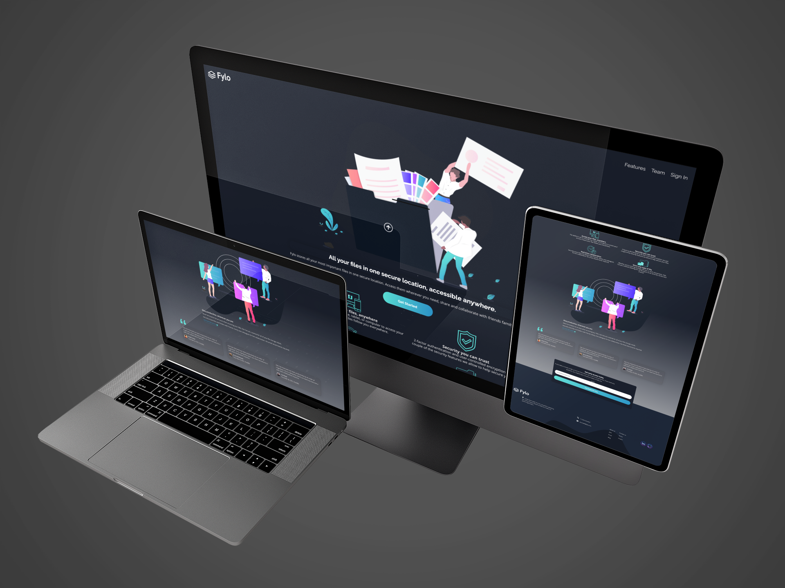
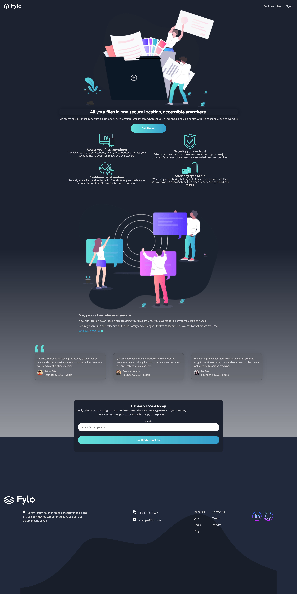

## Welcome !👋

Thanks for checking out this [Frontend Mentor](https://www.frontendmentor.io/) coding. This is my solution to the [Fylo dark theme landing page](https://www.frontendmentor.io/challenges/fylo-dark-theme-landing-page-5ca5f2d21e82137ec91a50fd). I have to build this application using only the preview images and the especifications. To this challenge I created my own design changes and personal improvements to the challenge elements.

<h1 align="center">Fylo dark theme landing page</h1>

 

Contents

- [🔰 About](#about)
  - [Layout](#layout)
- [🚀 Tech](#tech)
- [🎨 Style Guide](#style-guide)
  - [Colors:](#colors)
  - [Typography:](#typography)
- 📌[Features](#features)
- [📧 Author](#author)

## About

### The challenge

Users should be able to:

* View the optimal layout for the site depending on their device's screen size
* See hover states for all interactive elements on the page
* View the optimal layout for the content depending on their device's screen size
* See hover states for all interactive elements on the page

### Layout




## Tech

- Semantic HTML5 markup
- CSS custom properties
- CSS Grid
- CSS FLEXBOX
- Responsive design with Mobile-first workflow

## Style Guide

### Colors:

```css
:root {
- Dark Blue (intro and email sign up background): hsl(217, 28%, 15%)
- Dark Blue (main background): hsl(218, 28%, 13%)
- Dark Blue (footer background): hsl(216, 53%, 9%)
- Cyan (inside call-to-action gradient): hsl(176, 68%, 64%)
- Blue (inside call-to-action gradient): hsl(198, 60%, 50%)
- Light Red (error): hsl(0, 100%, 63%)
and Custom colors
}
```

## Typography:

### Body

* Font size: 14px

### Font

### Headings, Call-to-actions, Header Navigation

- Family: [Raleway](https://fonts.google.com/specimen/Raleway)
- Weights: 400, 700

### Body

- Family: [Open Sans](https://fonts.google.com/specimen/Open+Sans)
- Weights: 400, 70


(you can find the font in [Google Font](https://fonts.google.com/))

## Features

* 🎨 Focus on menu-list
* 📱 Responsive design with mobile-first workflow
* 🧚‍♂️ A little bit of color customization and background.

## Author

**David Willian Chaves**

- https://www.linkedin.com/in/david0chaves/
- https://github.com/davidchaves
- https://twitter.com/david__chaves
- https://www.instagram.com/david_.chaves/The challenge

Users should be able to:
